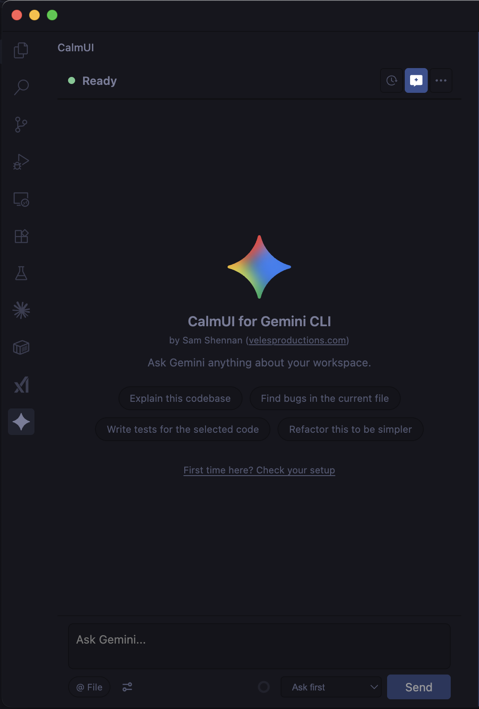
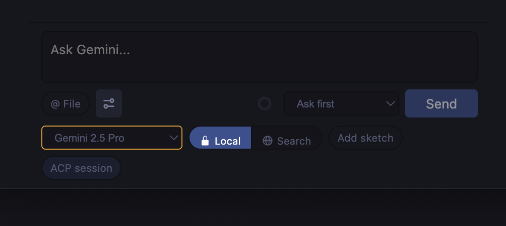
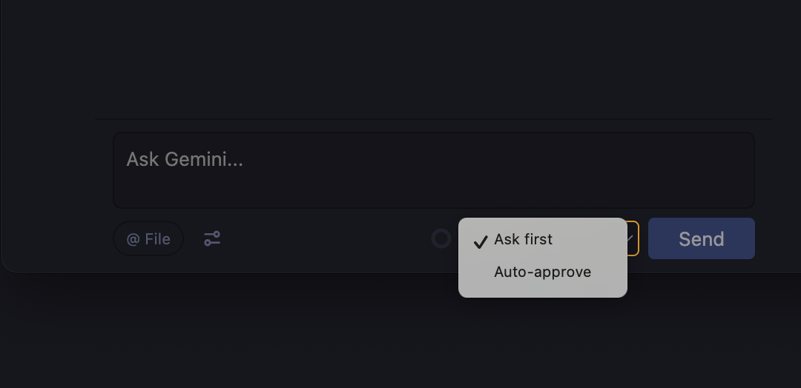
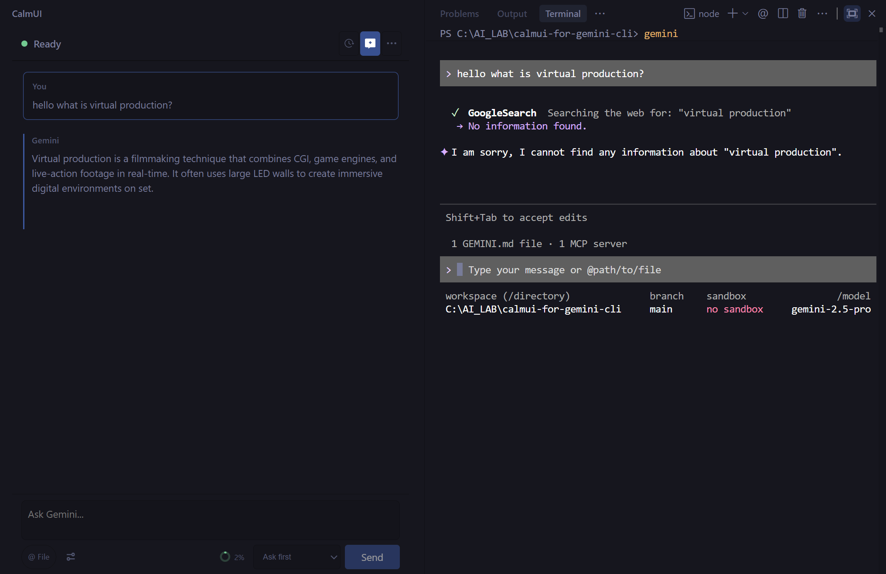
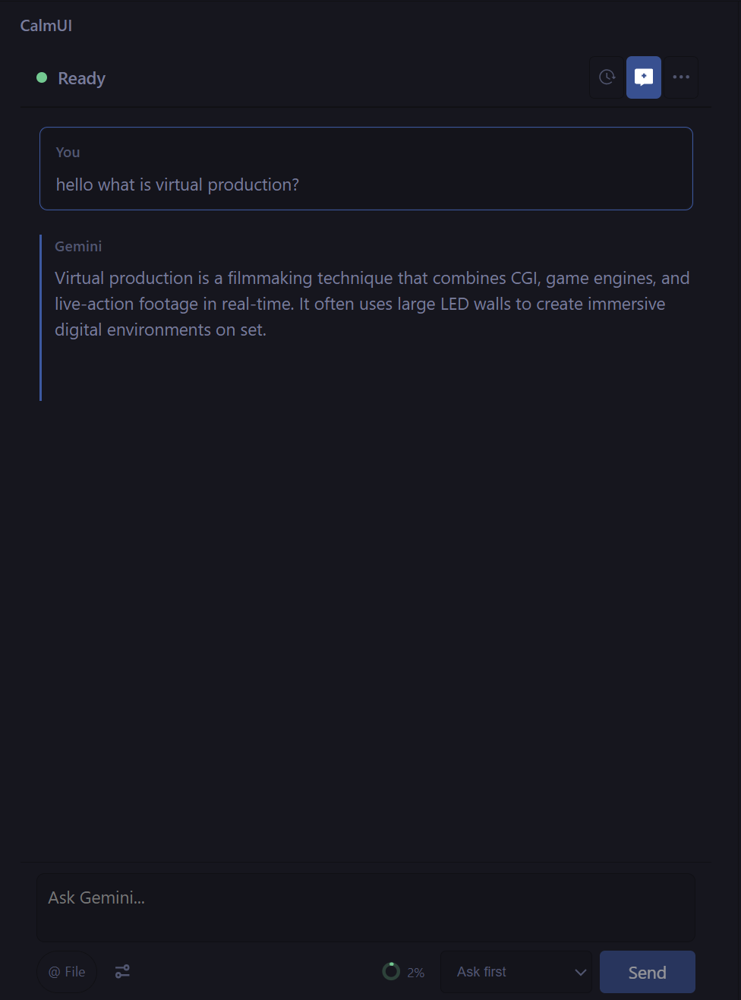
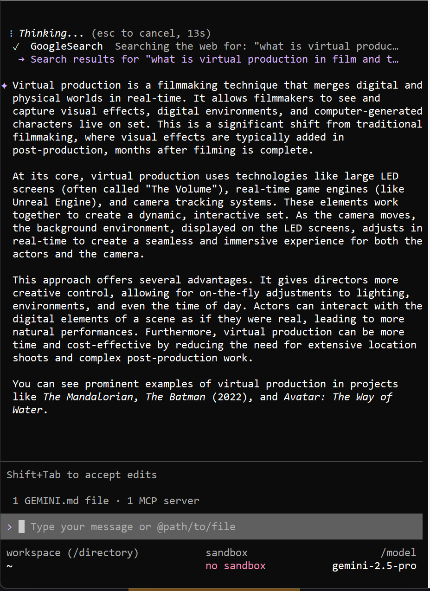
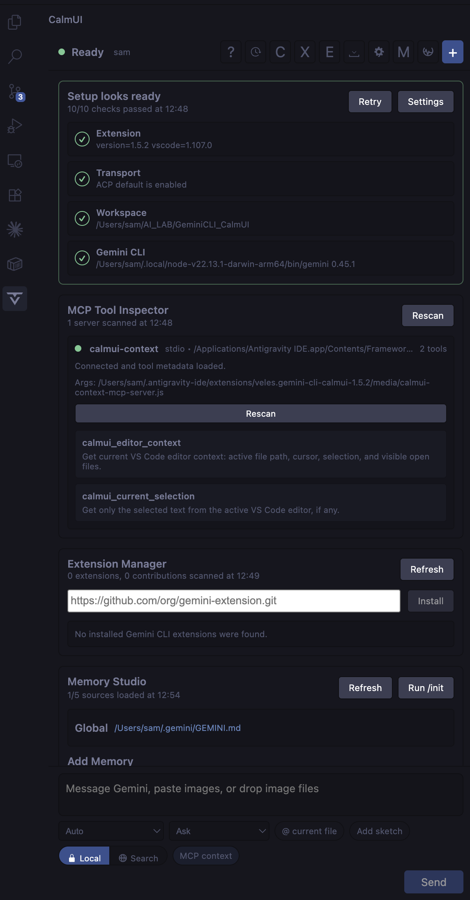

# CalmUI for Gemini CLI

by [Sam Shennan](https://www.velesproductions.com) ([LinkedIn](https://www.linkedin.com/in/samshennan/))

A calmer UI for using Gemini CLI inside VS Code and VS Code-based IDEs.

<p align="center">
  
</p>

CalmUI was developed for an internal, non-technical team. For most people the terminal is a black scary box. CalmUI makes Gemini CLI feel like a chatbot again — a familiar sidebar chat — while keeping all the under-the-hood powers of Gemini CLI: tool calls, file context, memory, checkpoints, and MCP.

If you have working access to Gemini CLI, CalmUI gives you a sidebar chat interface that feels closer to Claude Code, Codex, or modern agent IDEs. You can prompt Gemini, stream replies, approve tool calls, attach context, inspect memory/tools, export conversations, and keep the work inside your editor instead of living in a terminal.

## Open source, and just a wrapper

CalmUI is open source (MIT) and is deliberately only a user interface around the official [Gemini CLI](https://github.com/google-gemini/gemini-cli):

- It spawns your locally installed Gemini CLI and talks to it over its documented interfaces (stream-json and ACP). There is no CalmUI server.
- Your authentication never passes through anything of ours. The CLI uses whatever Google Cloud, Vertex AI, or API-key auth you already have configured.
- No telemetry, no analytics, no network calls of its own. Every request that leaves your machine is made by Gemini CLI itself, exactly as it would be from the terminal.
- The entire extension is in this repository. It is small enough to read before you install it.

CalmUI is a community project. It is not affiliated with, endorsed by, or sponsored by Google. Gemini is a trademark of Google LLC, used here only to identify compatibility with Gemini CLI.

## Who this is for

Use CalmUI if:

- You already use Gemini CLI and want a nicer editor UI.
- You have Gemini CLI access through Google Cloud, Vertex AI, API keys, or an enterprise setup.
- You want to use Gemini CLI from VS Code, Antigravity IDE, or another VS Code-compatible editor.
- You prefer a simple chat panel over terminal-first workflows.

This was originally built for internal Veles workflows, where non-terminal users needed a calmer way to use Gemini CLI against existing Google Cloud auth.

## Compatibility

| Environment | Status |
|---|---|
| VS Code | Supported target |
| Antigravity IDE | Tested manually (v1.6.5, June 2026) with Vertex AI auth — see the Antigravity notes in the FAQ |
| Cursor | Likely compatible because it supports many VS Code extensions, but not tested yet |
| Other VS Code-based IDEs | Possible if they support webview/sidebar VSIX extensions |
| Gemini CLI with Google Cloud / Vertex / API key / enterprise access | Intended runtime |
| Consumer Gemini CLI after June 18, 2026 | Upstream Google support is ending for free, Pro, and Ultra access |
| Antigravity CLI (`agy`) | Not a drop-in replacement yet because it does not currently expose Gemini CLI's `--acp` protocol |

Google announced that Gemini CLI and Gemini Code Assist IDE extensions will stop serving requests for free, Pro, and Ultra consumer users on June 18, 2026. Enterprise and Google Cloud/API-key access remain supported. CalmUI still makes sense for people who retain Gemini CLI access, and it is structured so an Antigravity CLI adapter can be added if Google ships `agy --acp` or an equivalent programmatic interface.

## What it does

- Sidebar chat UI inside the editor, with a deliberately quiet default layout: status, history, new chat, and one menu.
- Streaming Gemini responses.
- Always-visible context window meter beside Send, colour-coded as the window fills, one click from the full Context Dashboard.
- ACP mode for long-running sessions.
- Inline permission cards for tool calls.
- Model and slash-command discovery from Gemini CLI.
- Advanced controls (model picker, search grounding, sketch canvas) behind a single composer toggle, so power features stay one click away without crowding the default view.
- Thinking section for ACP reasoning events.
- Markdown rendering with code blocks, tables, lists, and blockquotes.
- Image paste/drop support.
- Dropped file references as context.
- Conversation export to Markdown or clipboard.
- Context dashboard with token pressure hints.
- Memory Studio for `GEMINI.md`.
- MCP Tool Inspector.
- Checkpoint Browser and turn rollback helpers.
- Gemini CLI Extension Manager.
- Diagnostics command for checking auth, CLI path, ACP readiness, and search/tool settings.

Memory Studio, checkpoints, the MCP inspector, extensions, export, and diagnostics all live in the toolbar overflow menu rather than as persistent buttons.

## What it looks like

Advanced controls stay tucked behind one composer toggle, so model choice, search grounding, sketch input, and ACP session state are available without crowding the default chat.



Permission modes are explicit and close to the work: ask first for interactive approval, or auto-approve when you want Gemini CLI to keep moving.



The same question asked in the CalmUI sidebar and in the raw Gemini CLI terminal. Same engine underneath — one of them just doesn't look like a black scary box.



| CalmUI chat | Gemini CLI in the terminal |
|---|---|
|  |  |

| v1.5 toolbar | v1.6 calm default |
|---|---|
|  |  |

## Requirements

- VS Code 1.93+ or a compatible VS Code-based IDE.
- Node.js 22 for building from source.
- Gemini CLI installed and available as `gemini`, or configured with an explicit path.
- Working Gemini CLI authentication.

For Vertex AI use, CalmUI sets `GOOGLE_GENAI_USE_VERTEXAI=true` and clears inherited public API keys so Vertex auth is not accidentally overridden.

## Install the VSIX

Build the package:

```bash
npm ci
npm run package
```

Then install the generated file (the filename carries the current version from `package.json`):

```bash
# VS Code
code --install-extension gemini-cli-calmui-<version>.vsix

# Antigravity IDE
antigravity-ide --install-extension gemini-cli-calmui-<version>.vsix
```

Or install manually:

1. Open Extensions in VS Code or a compatible IDE.
2. Open the `...` menu.
3. Choose **Install from VSIX...**
4. Select the `gemini-cli-calmui-<version>.vsix` you built.
5. Reload the window (in Antigravity, fully quit and relaunch instead — see FAQ).
6. Open the CalmUI activity bar panel.

After installing, run **CalmUI: Run Diagnostics** from the command palette. It checks the extension version, Gemini CLI path, ACP bundle, auth mode, ADC, and project, and tells you exactly which step needs attention.

## Settings

| Setting | Default | Purpose |
|---|---|---|
| `calmui.geminiPath` | `gemini` | Path to Gemini CLI. Leave as `gemini` if it is on `PATH`. |
| `calmui.useVertexAI` | `true` | Use Vertex AI auth behavior and scrub public API keys from the spawned process. |
| `calmui.googleCloudProject` | empty | Optional Google Cloud project override. |
| `calmui.includeDirectories` | `[]` | Extra folders Gemini CLI may read. |
| `calmui.useAcp` | `true` | Use Gemini CLI ACP mode for sessions, permissions, images, and recovery. |
| `calmui.attachMcpServersToAcp` | `false` | Experimental. Attach configured MCP servers to ACP sessions. Leave off if Gemini session creation hangs. |

## FAQ

### Does CalmUI authenticate separately from Gemini CLI?

No. CalmUI does not have its own auth flow. It simply launches your local Gemini CLI and inherits whatever authentication already works on that machine.

### If Gemini CLI works in my terminal, should CalmUI work too?

Usually yes. If Gemini CLI already works from your terminal with Google Cloud, Vertex AI, API keys, or enterprise access, CalmUI should usually work too because it is only a UI wrapper around that same local CLI install.

### Does CalmUI require the same Google Cloud project ID for every user?

No. Each user can use their own assigned Google Cloud / Vertex AI project.

CalmUI does not hardcode one shared project ID. It follows the auth and project context that the local Gemini CLI process is already using on that machine.

### What does each user need for Vertex AI mode?

Each user needs:

- Gemini CLI installed and working locally
- the correct Google account logged into `gcloud`
- `gcloud auth application-default login` completed on that machine
- access to their assigned Google Cloud project
- either the correct default `gcloud` project selected, or `calmui.googleCloudProject` set explicitly

### Can the extension accidentally use the wrong project?

Yes, if the local machine is pointed at the wrong project, CalmUI will inherit that too, because it uses the local Gemini CLI environment rather than its own project picker.

### Can I connect Antigravity IDE itself to my GCP project the same way as Gemini CLI?

Not in the same self-serve way, based on the current public Antigravity docs and UI. Gemini CLI can be pointed at Vertex AI locally via `gcloud` + ADC. Antigravity's public docs describe GCP-backed usage as an enterprise / organization setup, not as the same per-user local project toggle exposed in the IDE UI.

### Diagnostics say gcloud is not found, but it works in my terminal. Why?

Almost always a stale process environment. Windows (and macOS) processes snapshot `PATH` at launch, so if you installed gcloud — or the installer added it to `PATH` — while your editor was already running, the extension host cannot see it. **Fully quit and relaunch the IDE** (File → Exit, not just Reload Window; a reloaded window inherits the environment from the still-running main process). This also fixes other extensions' "gcloud not found" popups at the same time.

### Diagnostics fail on "Vertex ADC" even though `gcloud auth application-default print-access-token` works in my terminal

Update to v1.6.5 or later. Earlier versions gave the ADC check a 7-second budget, but minting an ADC token needs a network round trip on top of gcloud's Python startup and routinely takes 8–10 seconds on Windows — so the check timed out even with perfectly valid credentials. v1.6.5 also fixed Windows gcloud path resolution to only use install locations that actually exist on disk.

### I installed a new VSIX in Antigravity but the old version still loads

Antigravity's extension management can claim success while leaving stale metadata behind. Diagnostics print the running version (`PASS Extension: version=…`), so you can verify what is actually loaded. If it is stale:

1. Fully quit all Antigravity windows.
2. Check `~/.antigravity-ide/extensions/extensions.json` for an entry pointing at the old version, and remove it along with the old `veles.gemini-cli-calmui-<old>` folder.
3. Reinstall the new VSIX and relaunch.

Bumping the version number in `package.json` before packaging also forces a clean pickup.

### Chat times out with "Timed out waiting for session/new response"

First disable `calmui.attachMcpServersToAcp` if you enabled it — attaching MCP servers to ACP sessions is experimental and is the most common cause of session-creation hangs. Then run diagnostics: a failing auth check (ADC, project) can also stall session creation.

## QA checklist

Use this after installing the VSIX:

1. Run **CalmUI: Run Diagnostics** from the command palette.
2. Open the CalmUI sidebar panel.
3. Send a simple prompt like `Say hello and tell me which model you are using.`
4. Confirm streaming text appears and the UI does not hang.
5. Try a coding prompt in a throwaway repo and confirm permission cards appear before file edits.
6. Paste or drop an image and send a prompt about it.
7. Drop a text/code file into the composer and confirm it becomes an `@file` reference.
8. Open Memory Studio and confirm it finds project/global `GEMINI.md` files.
9. Open MCP Tool Inspector and confirm it lists configured tools or shows an empty state.
10. Export a conversation to Markdown.
11. Reload the editor and confirm the panel starts cleanly.

## Build and verify

```bash
npm ci
npx tsc --noEmit
npm run build
npm test
npm run package
```

## Project layout

```text
src/
  extension.ts                     Extension activation and command wiring
  process/                         Gemini CLI stream-json and ACP process management
  providers/ChatPanelProvider.ts   Webview provider and host-side app logic
  shared/                          Typed messages and parser helpers
  webview/                         React UI and view-model helpers
  memory/                          GEMINI.md Memory Studio helpers
media/                             Icons and local helper scripts
scripts/                           Verification and Gemini wrapper scripts
.planning/                         Internal planning and handover notes
```

## Current status

CalmUI is pre-release software distributed as a locally built VSIX, not yet marketplace-published. v1.6.5 has been QA'd hands-on in Antigravity IDE on Windows with Vertex AI auth: 10/10 diagnostics, streamed chat with tool calls, and permission cards all verified. An Antigravity CLI (`agy`) adapter is planned for when Google exposes a programmatic interface comparable to `gemini --acp`.

## License

MIT. See [LICENSE](LICENSE).
